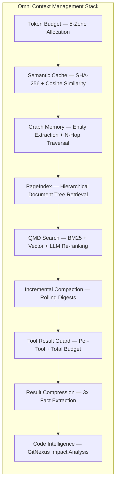
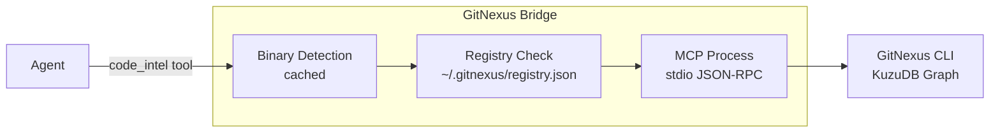
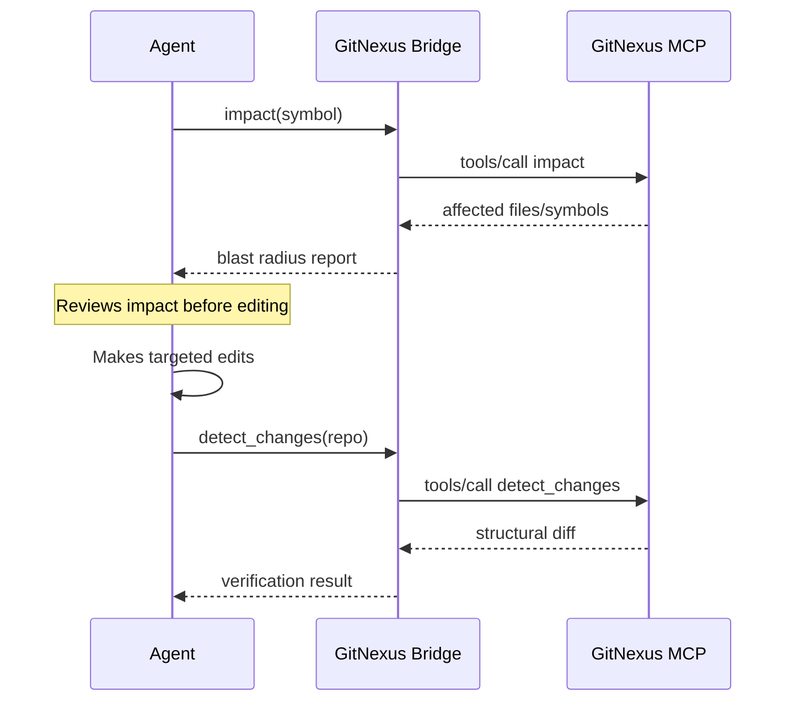
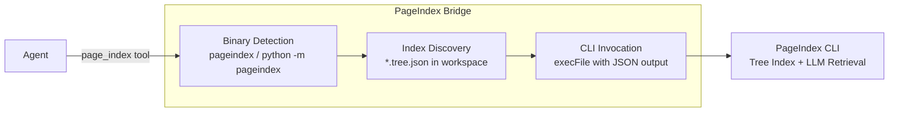

# Omni — OpenClaw for Enterprises

> Enterprise-grade enhancements built on top of [OpenClaw](https://github.com/openclaw/openclaw).

Omni extends OpenClaw with security hardening, compliance profiles, enterprise AI providers, fleet-wide device management, operator lifecycle, SSO provisioning, intelligent context management, and a browser-based onboarding wizard. All changes are additive — the core OpenClaw platform is unchanged.

---

## Enterprise AI Providers

Wizard-guided setup for enterprise-grade AI providers alongside existing API key and OAuth subscription support.

- **Azure OpenAI** — endpoint + deployment-based auth, model discovery.
- **AWS Bedrock** — region selection, IAM/access key auth (Anthropic, Meta, Mistral, Amazon models).
- **Google Vertex AI** — gcloud ADC auth, location-based routing (Gemini model family).

Docs: [`docs/start/enterprise-providers.md`](docs/start/enterprise-providers.md)

---

## Security Hardening

### Compliance Profiles

Pre-configured security postures selectable during onboarding (`openclaw onboard`) or via `security.complianceProfile`:

| Profile | Sandbox | Auth | Logging | Tool Safety |
|---------|---------|------|---------|-------------|
| **Zero Trust** | All sessions sandboxed | SSO enforced | Full audit | Strict allowlists |
| **SOC 2 Hardened** | Non-main sandboxed | Token + password | Audit trail | Monitored |
| **HIPAA** | All sessions sandboxed | SSO enforced | Full audit + PHI controls | Strict |
| **Standard** | Non-main sandboxed | Token | Standard | Default allowlists |
| **Development** | Optional | Optional | Minimal | Permissive |

Source: [`src/wizard/compliance-profiles.ts`](src/wizard/compliance-profiles.ts)

### OWASP Coverage Mapping

Controls map to **OWASP Top 10 for LLM Applications 2025** (LLM01–LLM10) and **OWASP Agentic AI Top 10** (AG01–AG05).

Source: [`src/wizard/owasp-mapping.ts`](src/wizard/owasp-mapping.ts) · Docs: [`docs/security/owasp.md`](docs/security/owasp.md)

### Audit Trail

SHA-256 hash-chained immutable event log with tamper detection.

- **Categories:** auth, config, tool, skill, sandbox, device, approval, operator, remote-agent, SSO, fleet, code-intel.
- **Operations:** query, stream, verify chain integrity, export (JSON/SIEM).
- **Severity levels:** info, warning, error, critical.

Source: [`src/security/audit-trail.ts`](src/security/audit-trail.ts) · Docs: [`docs/security/audit-trail.md`](docs/security/audit-trail.md)

### Distributed Trace Correlation

W3C-Trace-Context-compatible carrier that stamps audit events with `traceId` / `spanId`, so every security event can be pivoted to a full execution span in any OTEL backend (Datadog, Splunk, Honeycomb, Jaeger) without coupling core code to an OTEL SDK.

- **Zero dependencies:** AsyncLocalStorage-backed, no OpenTelemetry SDK in core.
- **W3C `traceparent`** header parse/format — interoperable with any upstream proxy or gateway that emits standard trace headers.
- **Audit query:** events are filterable by `traceId`, enabling SIEM pivots from a `tool.blocked` audit event to the complete request span tree.
- **Hash-chain safe:** new events include the trace field in their hashed payload; prior events still validate (JSON.stringify omits absent fields) — no migration required.

Source: [`src/security/trace-context.ts`](src/security/trace-context.ts)

### Device Trust

Compliance scoring and trust levels for paired devices.

- **Trust levels:** high (80–100), medium (50–79), low (20–49), untrusted (0–19).
- **Signals:** encryption, firewall, screen lock, biometrics, MDM enrollment, OS version.
- **Policy enforcement:** access restrictions based on trust level.

Source: [`src/security/device-trust.ts`](src/security/device-trust.ts) · Docs: [`docs/security/device-trust.md`](docs/security/device-trust.md)

### LLM Audit Interceptor

Inspects prompts and responses for security threats.

- **Prompt injection detection** — system instruction override attempts.
- **Data exfiltration scanning** — API keys, tokens, credentials, PII patterns.
- **Privilege escalation checks** — sandbox bypass attempts.

Source: [`src/security/llm-audit.ts`](src/security/llm-audit.ts) · Docs: [`docs/security/llm-audit.md`](docs/security/llm-audit.md)

### Skill Trust Verification

Content-hash verification for skill integrity.

- **Trust levels:** trusted, unverified, quarantined.
- **Content hashing:** SHA-256 at install time, verified before execution.
- **Quarantine:** block execution on integrity failure or admin action.

Source: [`src/security/skill-trust.ts`](src/security/skill-trust.ts) · Docs: [`docs/security/skill-trust.md`](docs/security/skill-trust.md)

### Sandbox Defaults

Per-compliance-profile tool allowlists and denylists.

Source: [`src/security/sandbox-defaults.ts`](src/security/sandbox-defaults.ts)

---

## Admin & Operator Management

### Admin Profiles (RBAC)

Four roles with five scopes:

| Role | Scopes |
|------|--------|
| `admin` | operator.admin, operator.read, operator.write, operator.approvals, operator.pairing |
| `operator` | operator.read, operator.write, operator.approvals, operator.pairing |
| `viewer` | operator.read |
| `auditor` | operator.read |

Source: [`src/security/admin-profile.ts`](src/security/admin-profile.ts) · Docs: [`docs/security/admin.md`](docs/security/admin.md)

### Operator Store

Full CRUD lifecycle for operator management:

- Create, read, update, delete operators.
- Invite flow with crypto token and 7-day TTL.
- Email validation, duplicate prevention, self-deletion guard.
- Admin seeding from `AdminProfile` (idempotent).

Source: [`src/security/operator-store.ts`](src/security/operator-store.ts) · Docs: [`docs/security/operators.md`](docs/security/operators.md)

### SSO Provisioning

SAML and OIDC provider integration:

- **Auto-provisioning:** new operators created on first SSO login.
- **Attribute mapping:** configurable email/displayName/groups extraction.
- **Group policies:** SSO groups map to roles and additional scopes.
- **Auto-revoke:** remove scopes when group membership changes.

Source: [`src/security/sso-provisioner.ts`](src/security/sso-provisioner.ts)

---

## Fleet Management

### Remote Agent Registry

Track and synchronize agent configurations across devices:

- **Push/Pull:** deploy or retrieve agent configs across devices.
- **Diff:** field-level comparison between devices.
- **Drift detection:** SHA-256 config hashing, scan fleet for diverged configs.
- **Registry persistence:** `~/.openclaw/remote-agents.json`.

Source: [`src/agents/remote-registry.ts`](src/agents/remote-registry.ts)

### Fleet Bulk Operations

| Operation | Description |
|-----------|-------------|
| `policy-push` | Push security/compliance policies to target devices |
| `token-rotate` | Bulk rotate device authentication tokens |
| `wipe` | Remote wipe (requires explicit confirmation) |
| `agent-sync` | Synchronize agent configs across fleet |

- **Compliance reporting:** aggregate device trust scores fleet-wide.
- **Fleet overview:** summary by trust level, total devices/agents.
- **Operation tracking:** in-memory store with status and per-device results.

Source: [`src/security/fleet-manager.ts`](src/security/fleet-manager.ts) · Docs: [`docs/security/fleet.md`](docs/security/fleet.md)

---

## Intelligent Context Management

### Token Budget

Zone-based context window partitioning with min/max/preferred allocations:

| Zone | Purpose |
|------|---------|
| `system` | System prompt, AGENTS.md, SOUL.md, TOOLS.md |
| `tools` | Tool definitions and schemas |
| `memory` | Long-term memory (vector, FTS, graph) |
| `history` | Conversation history |
| `reserve` | Buffer for model response |

Source: [`src/agents/token-budget.ts`](src/agents/token-budget.ts) · Docs: [`docs/concepts/token-budget.md`](docs/concepts/token-budget.md)

### Semantic Cache

Cross-session LLM response caching:

- **Exact match:** SHA-256 hash lookup for instant hits.
- **Semantic match:** cosine similarity with configurable threshold (default 0.92).
- **LRU eviction** with configurable TTL.

Source: [`src/agents/semantic-cache.ts`](src/agents/semantic-cache.ts) · Docs: [`docs/concepts/semantic-cache.md`](docs/concepts/semantic-cache.md)

### Graph Memory

SQLite-backed knowledge graph alongside vector + FTS:

- **Entity extraction** from conversations.
- **Relationship tracking** with typed edges.
- **Subgraph search** within N hops.
- **Time-based edge decay** for recency weighting.

Source: [`src/memory/graph/`](src/memory/graph/) · Docs: [`docs/concepts/graph-memory.md`](docs/concepts/graph-memory.md)

### Context Management Architecture

### Code Intelligence

#### GitNexus — Structural Code Analysis

Auto-detected external tool that provides knowledge-graph-based code intelligence via MCP.

| Action | Description |
|--------|-------------|
| `status` | Check if GitNexus is available and workspace is indexed |
| `query` | Search the knowledge graph by symbol name or pattern |
| `context` | Get full context: definition, callers, callees, community |
| `impact` | Analyze blast radius: what breaks if this symbol changes? |
| `detect_changes` | Compare current code against indexed graph |
| `rename` | Coordinated rename across all references |
| `list_repos` | List all indexed repositories |
| `index` | Index workspace (background, detached) |

**Impact-Aware Editing Sequence:**

Skill: [`skills/gitnexus/SKILL.md`](skills/gitnexus/SKILL.md) · Source: [`src/agents/tools/gitnexus-bridge.ts`](src/agents/tools/gitnexus-bridge.ts)

#### PageIndex — Hierarchical Document Retrieval

Auto-detected external tool that provides hierarchical document-section tree indexing with LLM-based reasoning retrieval. Complements Graph Memory (entity-level) with document-structure-level navigation.

| Action | Description |
|--------|-------------|
| `status` | Check if PageIndex is installed and list indexed documents |
| `index` | Generate hierarchical tree index for a document (PDF/markdown) |
| `retrieve` | Reasoning-based retrieval: query the tree to find relevant sections |
| `tree` | View the generated hierarchical tree structure |
| `list_indexes` | List all indexed documents in the workspace |

Skill: [`skills/pageindex/SKILL.md`](skills/pageindex/SKILL.md) · Source: [`src/agents/tools/pageindex-bridge.ts`](src/agents/tools/pageindex-bridge.ts)

---

## Web Wizard (Control UI)

Browser-based onboarding wizard as an alternative to `openclaw onboard` CLI:

- Multi-step flow with sidebar progress tracking.
- Compliance profile selection with visual cards and risk indicators.
- Enterprise provider setup (Azure, Bedrock, Vertex AI).
- Real-time progress feedback.

Access via the [Control UI](https://docs.openclaw.ai/web) when the Gateway is running.

Source: [`ui/src/ui/views/wizard.ts`](ui/src/ui/views/wizard.ts) · [`ui/src/ui/controllers/wizard.ts`](ui/src/ui/controllers/wizard.ts)

---

## Gateway Methods Added

All new methods follow the existing handler pattern (validate → business logic → audit → respond).

### Operator Management

| Method | Scope | Description |
|--------|-------|-------------|
| `operators.list` | READ | List operators with optional role filter |
| `operators.get` | READ | Get operator by ID or email |
| `operators.create` | ADMIN | Create operator with role and scopes |
| `operators.update` | ADMIN | Update role, scopes, display name, disabled |
| `operators.delete` | ADMIN | Remove operator (self-deletion prevented) |
| `operators.invite` | ADMIN | Generate invite token for email |
| `operators.redeem` | Public | Redeem invite token |
| `operators.sessions` | READ | List active sessions for operator |

### Remote Agent Registry

| Method | Scope | Description |
|--------|-------|-------------|
| `remote.agents.list` | READ | List agents across devices |
| `remote.agents.get` | READ | Get single remote agent entry |
| `remote.agents.push` | ADMIN | Push config to target device(s) |
| `remote.agents.pull` | ADMIN | Pull state from device |
| `remote.agents.sync` | ADMIN | Bidirectional sync |
| `remote.agents.diff` | READ | Compare configs between devices |
| `remote.agents.remove` | ADMIN | Remove from remote device |
| `remote.agents.drift` | READ | Scan fleet for drift |

### SSO

| Method | Scope | Description |
|--------|-------|-------------|
| `sso.callback` | Public | Process SSO assertion/token |
| `sso.status` | READ | Get SSO configuration status |
| `sso.test` | ADMIN | Dry-run SSO configuration test |

### Fleet Operations

| Method | Scope | Description |
|--------|-------|-------------|
| `fleet.overview` | READ | Fleet summary |
| `fleet.compliance` | READ | Full compliance report |
| `fleet.policy.push` | ADMIN | Push policies to devices |
| `fleet.tokens.rotate` | ADMIN | Bulk rotate tokens |
| `fleet.wipe` | ADMIN | Remote wipe (requires `confirm: true`) |
| `fleet.agents.sync` | ADMIN | Sync agents across fleet |
| `fleet.operations.list` | READ | List recent operations |
| `fleet.operations.get` | READ | Get operation status |

### Skill Trust

| Method | Scope | Description |
|--------|-------|-------------|
| `skills.trust.set` | ADMIN | Set trust level |
| `skills.trust.verify` | READ | Verify integrity |
| `skills.trust.quarantine` | ADMIN | Block execution |
| `skills.trust.release` | ADMIN | Release from quarantine |
| `skills.trust.audit` | READ | Trust change history |

### Code Intelligence

| Method | Scope | Description |
|--------|-------|-------------|
| `code-intel.status` | READ | GitNexus availability and index status |
| `code-intel.index` | ADMIN | Trigger GitNexus workspace indexing |
| `code-intel.query` | READ | Search knowledge graph by symbol pattern |
| `code-intel.impact` | READ | Analyze blast radius for a symbol |
| `code-intel.drift` | READ | Detect structural drift since last index |
| `code-intel.pageindex.status` | READ | PageIndex availability and indexed documents |
| `code-intel.pageindex.index` | ADMIN | Generate PageIndex tree for a document |

---

## Documentation Added

### Security Docs (`docs/security/`)

| File | Topic |
|------|-------|
| [`audit-trail.md`](docs/security/audit-trail.md) | Audit trail usage and configuration |
| [`device-trust.md`](docs/security/device-trust.md) | Device trust levels and policy enforcement |
| [`llm-audit.md`](docs/security/llm-audit.md) | LLM audit interceptor |
| [`skill-trust.md`](docs/security/skill-trust.md) | Skill trust verification |
| [`admin.md`](docs/security/admin.md) | Admin profiles and RBAC |
| [`owasp.md`](docs/security/owasp.md) | OWASP coverage mapping |
| [`operators.md`](docs/security/operators.md) | Operator management |
| [`fleet.md`](docs/security/fleet.md) | Fleet management |
| [`onboarding-security.md`](docs/security/onboarding-security.md) | Security onboarding guide |

### Concept Docs (`docs/concepts/`)

| File | Topic |
|------|-------|
| [`token-budget.md`](docs/concepts/token-budget.md) | Zone-based context partitioning |
| [`semantic-cache.md`](docs/concepts/semantic-cache.md) | Cross-session LLM response caching |
| [`graph-memory.md`](docs/concepts/graph-memory.md) | SQLite knowledge graph memory |

### Other Docs

| File | Topic |
|------|-------|
| [`docs/start/enterprise-providers.md`](docs/start/enterprise-providers.md) | Enterprise AI provider setup guides |

---

## Test Coverage

**175 new tests** across 14 test files:

| Test File | Tests | Module |
|-----------|-------|--------|
| `src/security/audit-trail.test.ts` | 15 | Audit trail |
| `src/security/device-trust.test.ts` | 16 | Device trust |
| `src/security/llm-audit.test.ts` | 9 | LLM audit |
| `src/security/skill-trust.test.ts` | 9 | Skill trust |
| `src/security/sandbox-defaults.test.ts` | 10 | Sandbox defaults |
| `src/security/operator-store.test.ts` | 13 | Operator store |
| `src/security/sso-provisioner.test.ts` | 10 | SSO provisioner |
| `src/security/fleet-manager.test.ts` | 9 | Fleet manager |
| `src/wizard/compliance-profiles.test.ts` | 14 | Compliance profiles |
| `src/wizard/owasp-mapping.test.ts` | 13 | OWASP mapping |
| `src/wizard/onboarding.security.test.ts` | 7 | Security onboarding |
| `src/agents/token-budget.test.ts` | 20 | Token budget |
| `src/agents/semantic-cache.test.ts` | 17 | Semantic cache |
| `src/agents/remote-registry.test.ts` | 13 | Remote agent registry |

---

## New Source Files

### Security (`src/security/`)

| File | Purpose |
|------|---------|
| `admin-profile.ts` | Admin profile creation and scope resolution |
| `audit-trail.ts` | Immutable hash-chained audit event log |
| `audit-trail.types.ts` | Audit trail type definitions |
| `audit-trail-emitters.ts` | Category-specific audit event emitters |
| `device-trust.ts` | Device compliance scoring and trust levels |
| `device-trust.types.ts` | Device trust type definitions |
| `llm-audit.ts` | LLM prompt/response security scanning |
| `llm-audit.types.ts` | LLM audit type definitions |
| `skill-trust.ts` | Skill integrity verification and quarantine |
| `skill-trust.types.ts` | Skill trust type definitions |
| `sandbox-defaults.ts` | Per-profile sandbox configurations |
| `sandbox-health.ts` | Sandbox health monitoring |
| `operator-store.ts` | Operator CRUD, invite flow, admin seeding |
| `operator-store.types.ts` | Operator store type definitions |
| `sso-provisioner.ts` | SSO callback processing and auto-provisioning |
| `sso-provisioner.types.ts` | SSO provisioner type definitions |
| `fleet-manager.ts` | Fleet bulk operations and compliance reporting |
| `fleet-manager.types.ts` | Fleet manager type definitions |

### Agents (`src/agents/`)

| File | Purpose |
|------|---------|
| `token-budget.ts` | Zone-based context window budget manager |
| `semantic-cache.ts` | Cross-session LLM response cache |
| `remote-registry.ts` | Remote agent registry with drift detection |
| `remote-registry.types.ts` | Remote registry type definitions |

### Skills

| File | Purpose |
|------|---------|
| `skills/gitnexus/SKILL.md` | GitNexus code intelligence skill definition |
| `skills/pageindex/SKILL.md` | PageIndex document retrieval skill definition |

### Code Intelligence Bridges (`src/agents/tools/`)

| File | Purpose |
|------|---------|
| `gitnexus-bridge.ts` | GitNexus MCP bridge — binary detection, registry, MCP process management |
| `pageindex-bridge.ts` | PageIndex CLI bridge — binary detection, index discovery, CLI invocation |

### Gateway Handlers (`src/gateway/server-methods/`)

| File | Purpose |
|------|---------|
| `operators.ts` | Operator management gateway handlers |
| `remote-agents.ts` | Remote agent registry gateway handlers |
| `sso.ts` | SSO provisioning gateway handlers |
| `fleet.ts` | Fleet operations gateway handlers |
| `audit-trail.ts` | Audit trail query/export gateway handlers |
| `code-intel.ts` | Code intelligence gateway handlers (GitNexus + PageIndex) |

### Wizard (`src/wizard/`)

| File | Purpose |
|------|---------|
| `compliance-profiles.ts` | Compliance profile definitions and config overlays |
| `owasp-mapping.ts` | OWASP coverage mapping |
| `onboarding.security.ts` | Security onboarding flow |
| `onboarding.admin.ts` | Admin profile setup during onboarding |

### Config Types (`src/config/`)

| File | Purpose |
|------|---------|
| `types.admin.ts` | Admin, SSO, ACL, group policy types |
| `types.security.ts` | Security configuration types |

### Memory (`src/memory/`)

| File | Purpose |
|------|---------|
| `graph/` | SQLite knowledge graph implementation |
| `result-compression.ts` | Memory result compression |

### UI (`ui/src/`)

| File | Purpose |
|------|---------|
| `ui/views/wizard.ts` | Web wizard onboarding view |
| `ui/controllers/wizard.ts` | Web wizard controller |
| `ui/views/activity.ts` | Activity dashboard view |
| `ui/controllers/activity.ts` | Activity dashboard controller |
| `styles/wizard.css` | Wizard styles |
| `styles/activity.css` | Activity dashboard styles |
